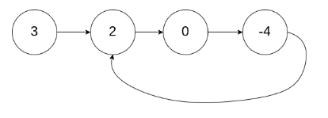
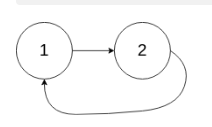
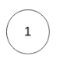
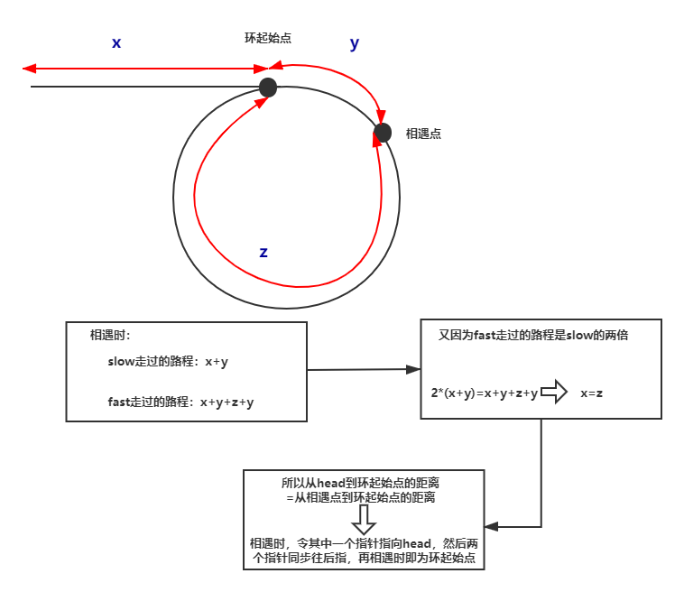
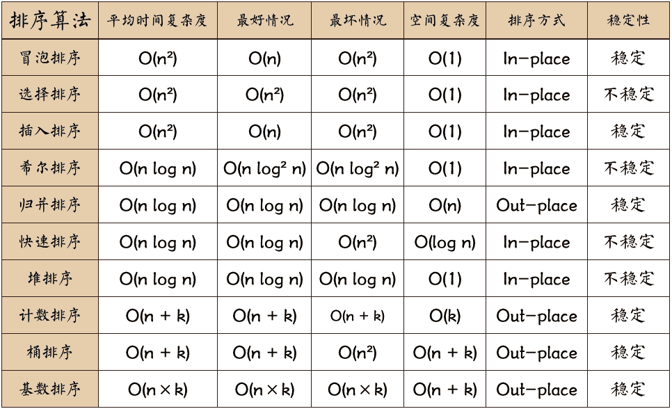
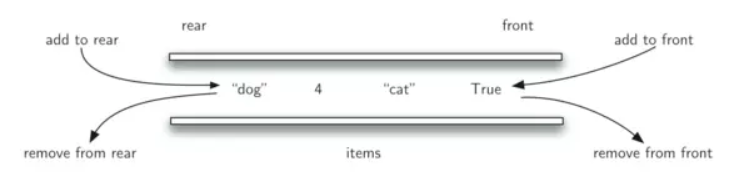

# Leetcode

## TIP

### 双指针：

1.链表里面是否有环，两个指针快慢一起跑

2.求链表中倒数第k个元素，可以一个指针先走7步，然后两个指针在一起走，之和慢指针那里就指向倒数第k个元素。

3.数组双指针，可以是快慢指针的情况。也可以是双指针在数组左右两边夹逼的这种情况，通常数组是排序的，排好序后，这两个指针他所指向的数的值加在一起表示它的sum，如果sum过小-->左指针右移、右指针左移

[养成收藏精选代码的习惯（示例）](http://shimo.im/docs/R6g9WJV89QkHrDhr)

---

## 一、数组

### 1.两数之和

[1两数之和 ](https://leetcode-cn.com/problems/two-sum/)

给定一个整数数组 nums 和一个目标值 target，请你在该数组中找出和为目标值的那 两个 整数，并返回他们的数组下标。你可以假设每种输入只会对应一个答案。但是，数组中同一个元素不能使用两遍。

```
示例: 给定 nums = [2, 7, 11, 15], target = 9
因为 nums[0] + nums[1] = 2 + 7 = 9
所以返回 [0, 1]
```

```java
//hash    时间复杂度:O(n)
public int[] twoSum(int[] nums, int target) {
    Map<Integer, Integer> map = new HashMap<>();
    for (int i = 0; i < nums.length; i++) {
        if (map.containsKey(target - nums[i])) {
            return new int[]{map.get(target - nums[i]), i};
        }
        map.put(nums[i], i);
    }
    throw new IllegalArgumentException("No two sum solution");
}
```

```java
//暴力双循环 空间复杂度:O(n^2)
public int[] twoSum(int[] nums, int target) {
    int[] arr = new int[2];
    int numsSize = nums.length;
    for (int i = 0; i < numsSize - 1; i++) {
        for (int j = i + 1; j < numsSize; j++) {
            if (nums[i] + nums[j] == target) {
                arr[0] = i;
                arr[1] = j;
                return arr;
            }
        }
    }
    return new int[0];
}
```

### 2.盛最多水的容器

[11盛最多水的容器](https://leetcode-cn.com/problems/container-with-most-water/)

给你 n 个非负整数 a1，a2，...，an，每个数代表坐标中的一个点 (i, ai) 。在坐标内画 n 条垂直线，垂直线 i 的两个端点分别为 (i, ai) 和 (i, 0)。找出其中的两条线，使得它们与 x 轴共同构成的容器可以容纳最多的水。

说明：你不能倾斜容器，且 n 的值至少为 2。


图中垂直线代表输入数组 [1,8,6,2,5,4,8,3,7]。在此情况下，容器能够容纳水（表示为蓝色部分）的最大值为 49。

```
示例：
输入：[1,8,6,2,5,4,8,3,7]
输出：49
```

```java
// O(n^2)  枚举 - left bar x, right bar y, (x-y)*hight_min
public int maxArea(int[] height) {
    int max = 0;
    //遍历有左右边界数组，且不重复
    for (int i = 0; i < height.length - 1 ; i++) {
        for (int j = i + 1; j < height.length; j++) {
            int area = Math.min(height[i], height[j]) * (j - i);
            max = Math.max(area, max);
        }
    }
    return max;
}
```

```java
//O(n) 左右边界i,j向中间收敛 左右夹逼
public int maxArea(int[] height) {
    if (height == null || height.length == 0) {
        return 0;
    }
    int max = 0;
    for (int i = 0, j = height.length - 1; i < j;) {
        int minHight = height[i] < height[j] ? height[i++] : height[j--];
        int area = minHight * (j - i + 1);
        max = Math.max(max, area);
    }
    return max;
}
```

### 3.移动零

[283移动零](https://leetcode-cn.com/problems/move-zeroes/)

给定一个数组 nums，编写一个函数将所有 0 移动到数组的末尾，同时保持非零元素的相对顺序。

```
示例:
输入: [0,1,0,3,12]
输出: [1,3,12,0,0]
```

说明：

​        必须在原数组上操作，不能拷贝额外的数组。
​        尽量减少操作次数。

时间复杂度:O(n)
空间复杂度:O(1)

```java
public void moveZeroes(int[] nums) {
    if (nums == null || nums.length == 0) {
        return;
    }
    //j记录非0元素位置
    int j = 0;
    for (int i = 0; i < nums.length; i++) {
        if (nums[i] != 0) { //如果数组当前元素不等于0
            nums[j] = nums[i];
            if (i != j ){
                nums[i] = 0;
            }
            j++;
        }
    }
}
```

### 4.爬楼梯

[70爬楼梯](https://leetcode.com/problems/climbing-stairs/)

假设你正在爬楼梯。需要 n 阶你才能到达楼顶。每次你可以爬 1 或 2 个台阶。

你有多少种不同的方法可以爬到楼顶呢？

注意：给定 n 是一个正整数。

```
示例 1：
    输入： 2
    输出： 2
    解释： 有两种方法可以爬到楼顶。
 1.  1 阶 + 1 阶
 2.  2 阶
```

```
示例 2：
    输入： 3
    输出： 3
    解释： 有三种方法可以爬到楼顶。
 1.  1 阶 + 1 阶 + 1 阶
 2.  1 阶 + 2 阶
 3.  2 阶 + 1 阶
```

斐波那契： *f*(*x*)=*f*(*x*−1)+*f*(*x*−2)

它意味着爬到第 x 级台阶的方案数是爬到第 x - 1级台阶的方案数和爬到第 x - 2级台阶的方案数的和。很好理解，因为每次只能爬1级或2级，所以f(x)只能从 f(x - 1)和 f(x - 2)转移过来，而这里要统计方案总数，我们就需要对这两项的贡献求和。


时间复杂度：O*(log*n*)，`pow` 方法将会用去 O*(log*n*) 的时间

空间复杂度：O(1)

```java
//通项公式
public class Solution {
    public int climbStairs(int n) {
        double sqrt5 = Math.sqrt(5);
        double fibn = Math.pow((1 + sqrt5) / 2, n + 1) - 
            Math.pow((1 - sqrt5) / 2, n + 1);
        return (int)(fibn / sqrt5);
    }
}
```

**思路和算法**

我们用 *f(x)* 表示爬到第 *x* 级台阶的方案数，考虑最后一步可能跨了一级台阶，也可能跨了两级台阶，所以我们可以列出如下式子：

 														 *f(x) = f(x - 1) + f(x - 2)*

它意味着爬到第 *x* 级台阶的方案数是爬到第 *x - 1* 级台阶的方案数和爬到第 *x - 2* 级台阶的方案数的和。

标签：动态规划 本问题其实常规解法可以分成多个子问题，爬第n阶楼梯的方法数量，等于 2 部分之和

1. 爬上 *n-1* 阶楼梯的方法数量。因为再爬1阶就能到第n阶
2. 爬上 *n-2* 阶楼梯的方法数量，因为再爬2阶就能到第n阶

我们不难通过转移方程和边界条件给出一个时间复杂度和空间复杂度都是 *O(n)* 的实现，但是由于这里的 *f(x)* 只和 *f(x - 1)* 与 *f(x - 2)* 有关，所以我们可以用「滚动数组思想」把空间复杂度优化成 *O(1)*。

```java
//动态规划
public int climbStairs(int n) {
    if (n <= 2) {
        return n < 0 ? 1 : n;
    }
    int f1 = 1, f2 = 2, f3 = 3;
    for (int i = 3; i < n + 1; i++) {
        f3 = f1 + f2;
        f1 = f2;
        f2 = f3;
    }
    return f3;
}
```

```java
public int climbStairs(int n) {
    if (n <= 2) {
        return n < 0 ? 1 : n;
    }
    int[] arr = new int[n + 1];
    arr[1] = 1;
    arr[2] = 2;
    for (int i = 3; i < arr.length; i++) {
        arr[i] = arr[i - 1] + arr[i - 2];
    }
    return arr[n];
}
```

### 5.三数之和

[15三数之和](https://leetcode-cn.com/problems/3sum/)

给你一个包含 *n* 个整数的数组 `nums`，判断 `nums` 中是否存在三个元素 *a，b，c ，*使得 *a + b + c =* 0 ？请你找出所有满足条件且不重复的三元组。

**注意：**答案中不可以包含重复的三元组。

```
示例：
给定数组 nums = [-1, 0, 1, 2, -1, -4]，
满足要求的三元组集合为：
[
  [-1, 0, 1],
  [-1, -1, 2]
]
```

**思路**

- 暴力法搜索为 *O(N^3)* 时间复杂度，可通过双指针动态消去无效解来优化效率。
- **双指针法铺垫：** 先将给定 `nums` 排序，复杂度为 *O(NlogN)*。
- **双指针法思路：** 固定 *3* 个指针中最左（最小）数字的指针 `k`，双指针 `i`，`j` 分设在数组索引 *(k, len(nums))* 两端，通过双指针交替向中间移动，记录对于每个固定指针 `k` 的所有满足 `nums[k] + nums[i] + nums[j] == 0` 的 `i`,`j` 组合：
  1. 当 `nums[k] > 0` 时直接`break`跳出：因为 `nums[j] >= nums[i] >= nums[k] > 0`，即 *3* 个数字都大于 *0* ，在此固定指针 `k` 之后不可能再找到结果了。
  2. 当 `k > 0`且`nums[k] == nums[k - 1]`时即跳过此元素`nums[k]`：因为已经将 `nums[k - 1]` 的所有组合加入到结果中，本次双指针搜索只会得到重复组合。
  3. `i`,`j` 分设在数组索引 `(k, len(nums))` 两端，当`i < j`时循环计算`s = nums[k] + nums[i] + nums[j]`，并按照以下规则执行双指针移动：
     - 当`s < 0`时，`i += 1`并跳过所有重复的`nums[i]`；
     - 当`s > 0`时，`j -= 1`并跳过所有重复的`nums[j]`；
     - 当`s == 0`时，记录组合`[k, i, j]`至`res`，执行`i += 1`和`j -= 1`并跳过所有重复的`nums[i]`和`nums[j]`，防止记录到重复组合。
- **复杂度分析：**
  - 时间复杂度 *O(N^2)*：其中固定指针`k`循环复杂度 *O(N)*，双指针 `i`，`j` 复杂度 *O(N)*。
  - 空间复杂度 *O(1)*：指针使用常数大小的额外空间。

```java
//暴力法搜索为 O(N^3) 
public List<List<Integer>> threeSum(int[] nums) {
    if (nums == null || nums.length == 0) {
        return Collections.emptyList();
    }   
    Arrays.sort(nums); //n*logn
    Set<List<Integer>> result = new LinkedHashSet<>();//判重
    for (int i = 0; i < nums.length - 2; i++) {//三重循环
        for (int j = i + 1; j < nums.length - 1; j++) {
            for (int k = j + 1; k < nums.length; k++) {
                if (nums[i] + nums[j] + nums[k] == 0) {
                    List<Integer> value = Arrays.asList(nums[i], nums[j], nums[k]);
                    result.add(value);
                }
            }
        }
    }
    return new ArrayList<>(result);
}
```

```java
 public List<List<Integer>> threeSum(int[] nums) {
    List<List<Integer>> resList = new ArrayList<>();
        if (nums == null || nums.length < 3) {
            return resList;
        }
        Arrays.sort(nums); //排序
        for (int i = 0; i < nums.length; i++) {
            //如果最小的数大于0，则不可能三数之和>0
            if (nums[i] > 0) break; 
            //去重,因为已经将nums[k - 1]的所有组合加入到结果中，本次双指针搜索只会得到重复组合。
            if (i > 0 && nums[i] == nums[i - 1]) continue; 
            int l = i + 1, r = nums.length - 1; //左右指针
            while (l < r) {
                int sum = nums[i] + nums[l] + nums[r];
                if (sum == 0) {
                    resList.add(Arrays.asList(nums[i], nums[l], nums[r]));
                    while (l < r && nums[l] == nums[++l]);//左边去重
                    while (l < r && nums[r] == nums[--r]);//右边去重
                } else if (sum > 0) {
                    r--;
                } else if (sum < 0) {
                    l++;
                }
            }
        }
        return resList;
 }
```

### 6.加一

[加一](https://leetcode-cn.com/problems/plus-one/)（谷歌、字节跳动、Facebook 在半年内面试中考过）


### 7.合并两个有序数组

[合并两个有序数组](https://leetcode-cn.com/problems/merge-sorted-array/)（Facebook 在半年内面试常考）


### 8.删除排序数组中的重复项

[删除排序数组中的重复项](https://leetcode-cn.com/problems/remove-duplicates-from-sorted-array/)（Facebook、字节跳动、微软在半年内面试中考过）


### 9.旋转数组

[旋转数组](https://leetcode-cn.com/problems/rotate-array/)（微软、亚马逊、PayPal 在半年内面试中考过）


## 二、链表

### 1.反转链表

[206反转链表](https://leetcode.com/problems/reverse-linked-list/)

反转一个单链表。

**示例:**

```
输入: 1->2->3->4->5->NULL
输出: 5->4->3->2->1->NULL
```

**进阶:**
你可以迭代或递归地反转链表。你能否用两种方法解决这道题？

**双指针迭代**

我们可以申请两个指针，第一个指针叫 pre，最初是指向 null 的。
第二个指针 cur 指向 head，然后不断遍历 cur。
每次迭代到 cur，都将 cur 的 next 指向 pre，然后 pre 和 cur 前进一位。
都迭代完了(cur 变成 null 了)，pre 就是最后一个节点了。

```java
public ListNode reverseList(ListNode head) {
    //申请节点，pre和 cur，pre指向null
    ListNode pre = null;
    ListNode cur = head;
    ListNode tmp = null;
    while(cur!=null) {
        tmp = cur.next;  //记录当前节点的下一个节点
        cur.next = pre; //然后将当前节点指向pre
        pre = cur; //pre和cur节点都前进一位
        cur = tmp;
    }
    return pre;
}
```

**递归解法**

递归的两个条件：

1. 终止条件是当前节点或者下一个节点==null
2. 在函数内部，改变节点的指向，也就是 head 的下一个节点指向 head 递归函数那句

```
head.next.next = head
```

很不好理解，其实就是 head 的下一个节点指向head。
递归函数中每次返回的 cur 其实只最后一个节点，在递归函数内部，改变的是当前节点的指向。

```java
public ListNode reverseList(ListNode head) {
    if (head == null || head.next == null) {
        return head;
    }
    ListNode p = reverseList(head.next);
    head.next.next = head;
    head.next = null;
    return p;
}
```

### 2.合并两个有序链表

[21合并两个有序链表](https://leetcode-cn.com/problems/merge-two-sorted-lists/description/)

将两个升序链表合并为一个新的 **升序** 链表并返回。新链表是通过拼接给定的两个链表的所有节点组成的。 

**示例：**

```
输入：1->2->4, 1->3->4
输出：1->1->2->3->4->4
```

**思路**

- 标签：链表、递归
- 这道题可以使用递归实现，新链表也不需要构造新节点，我们下面列举递归三个要素
- 终止条件：两条链表分别名为 l1 和 l2，当 l1 为空或 l2 为空时结束
- 返回值：每一层调用都返回排序好的链表头
- 本级递归内容：如果 l1的 val 值更小，则将 l1.next 与排序好的链表头相接，l2 同理
- O(m+n)，m为l1的长度，n为 l2 的长度

```java
public ListNode mergeTwoLists(ListNode l1, ListNode l2) {
    if(l1 == null) {
        return l2;
    } else if (l2 == null) {
        return l1;
    }
    if(l1.val < l2.val) {
        l1.next = mergeTwoLists(l1.next, l2);
        return l1;
    }else {
        l2.next = mergeTwoLists(l2.next, l1);
        return l2;
    }
}
```

### 3.两两交换链表中的节点

[24两两交换链表中的节点](https://leetcode.com/problems/swap-nodes-in-pairs)

给定一个链表，两两交换其中相邻的节点，并返回交换后的链表。

**你不能只是单纯的改变节点内部的值**，而是需要实际的进行节点交换。

**示例:**

```
给定 1->2->3->4, 你应该返回 2->1->4->3.
```

解答：双指针迭代


```java
public ListNode swapPairs(ListNode head) {
    if(head == null || head.next == null) {
        return head;
    }
    ListNode firstNode = head;
    ListNode secondNode = head.next;
    firstNode.next =  swapPairs(secondNode.next);
    secondNode.next = firstNode;
    return secondNode;
}
```

### 4.环形链表

[141环形链表](https://leetcode.com/problems/linked-list-cycle)

给定一个链表，判断链表中是否有环。

为了表示给定链表中的环，我们使用整数 `pos` 来表示链表尾连接到链表中的位置（索引从 0 开始）。 如果 `pos` 是 `-1`，则在该链表中没有环。

**示例 1：**

```
输入：head = [3,2,0,-4], pos = 1
输出：true
解释：链表中有一个环，其尾部连接到第二个节点。
```



```
输入：head = [1,2], pos = 0
输出：true
解释：链表中有一个环，其尾部连接到第一个节点。
```



**示例 3：**

```
输入：head = [1], pos = -1
输出：false
解释：链表中没有环。
```



解法1：快慢指针

​    通过使用具有 不同速度 的快、慢两个指针遍历链表，空间复杂度可以被降低至 O(1)。慢指针每次移动一步，而快指针每次移动两步。如果列表中不存在环，最终快指针将会最先到达尾部，此时我们可以返回 false。

​    时间复杂度：O(n)

```java
public boolean hasCycle(ListNode head) {
    if (head == null || head.next == null) {
        return false;
    }
    ListNode slow = head;
    ListNode fast = head.next;
    while (slow != fast) {
        if (fast == null || fast.next == null) {
            return false;
        }
        slow = slow.next;
        fast = fast.next.next;
    }
    return true;
}
```

解法2：哈希表

​    通过检查一个结点此前是否被访问过来判断链表是否为环形链表。常用的方法是使用哈希表

​    时间复杂度：O(n)

​    空间复杂度：O(n)

```java
public boolean hasCycle(ListNode head) {
    Set<ListNode> nodesSeen = new HashSet<>();
    while (head != null) {
        if (nodesSeen.contains(head)) {
            return true;
        } else {
            nodesSeen.add(head);
        }
        head = head.next;
    }
    return false;
}
```

### 5.环形链表II

[142环形链表 II](https://leetcode.com/problems/linked-list-cycle-ii)

给定一个链表，返回链表开始入环的第一个节点。 如果链表无环，则返回 `null`。

为了表示给定链表中的环，我们使用整数 `pos` 来表示链表尾连接到链表中的位置（索引从 0 开始）。 如果 `pos` 是 `-1`，则在该链表中没有环。

**说明：**不允许修改给定的链表。

**示例 1：**

```
输入：head = [3,2,0,-4], pos = 1
输出：tail connects to node index 1
解释：链表中有一个环，其尾部连接到第二个节点。
```


**示例 2：**

```
输入：head = [1,2], pos = 0
输出：tail connects to node index 0
解释：链表中有一个环，其尾部连接到第一个节点。
```


**示例 3：**

```
输入：head = [1], pos = -1
输出：no cycle
解释：链表中没有环。
```


解法1：哈希表

​    用一个 `Set` 保存已经访问过的节点，我们可以遍历整个列表并返回第一个出现重复的节点。

​    时间复杂度：O(n)

​    空间复杂度：O(n)

```java
public class Solution {
    public ListNode detectCycle(ListNode head) {
        Set<ListNode> visited = new HashSet<ListNode>();

        ListNode node = head;
        while (node != null) {
            if (visited.contains(node)) {
                return node;
            }
            visited.add(node);
            node = node.next;
        }
        return null;
    }
}
```

解法2：Floyd 算法 快慢指针




​    时间复杂度：O(n)

​    空间复杂度：O(1)

```java
public ListNode detectCycle(ListNode head) {
    ListNode slow = head;
    ListNode fast = head;
    //先判断有无环
    while(true) {
        if (fast == null || fast.next == null) return null;
        slow = slow.next;
        fast = fast.next.next;
        if (slow == fast) break;
    }
    //找链表连接点
    fast = head;
    while (fast != slow) {
        slow = slow.next;
        fast = fast.next;
    }
    return fast;
}
```

### 6.K 个一组翻转链表

[25K 个一组翻转链表](https://leetcode.com/problems/reverse-nodes-in-k-group/)

| Category   | Difficulty    | Likes | Dislikes |
|:----------:|:-------------:|:-----:|:--------:|
| algorithms | Hard (61.91%) | 643   | -        |

给你一个链表，每 *k* 个节点一组进行翻转，请你返回翻转后的链表。

*k* 是一个正整数，它的值小于或等于链表的长度。

如果节点总数不是 *k* 的整数倍，那么请将最后剩余的节点保持原有顺序。

**示例：**

给你这个链表：`1->2->3->4->5`

当 *k* = 2 时，应当返回: `2->1->4->3->5`

当 *k* = 3 时，应当返回: `3->2->1->4->5`

**说明：**

- 你的算法只能使用常数的额外空间。
- **你不能只是单纯的改变节点内部的值**，而是需要实际进行节点交换。


```java
public ListNode reverseKGroup(ListNode head, int k) {
    if (head == null || head.next == null){
        return head;
    }
    //定义一个假的节点。
    ListNode dummy = new ListNode(0);
    //假节点的next指向head。dummy->1->2->3->4->5
    dummy.next = head;
    //初始化pre和end都指向dummy。pre指每次要翻转的链表的头结点的上一个节点。end指每次要翻转的链表的尾节点
    ListNode pre = dummy;
    ListNode end = dummy;

    while(end.next != null){
        //循环k次，找到需要翻转的链表的结尾,这里每次循环要判断end是否等于空,因为如果为空，end.next会报空指针异常。
        //dummy->1->2->3->4->5 若k为2，循环2次，end指向2
        for(int i = 0;i < k && end != null;i++){
            end=end.next;
        }
        //如果end==null，即需要翻转的链表的节点数小于k，不执行翻转。
        if(end == null){
            break;
        }
        //先记录下end.next,方便后面链接链表
        ListNode next = end.next;
        //然后断开链表
        end.next = null;
        //记录下要翻转链表的头节点
        ListNode start = pre.next;
        //翻转链表,pre.next指向翻转后的链表。1->2 变成2->1。 dummy->2->1
        pre.next=reverse(start);
        //翻转后头节点变到最后。通过.next把断开的链表重新链接。
        start.next=next;
        //将pre换成下次要翻转的链表的头结点的上一个节点。即start
        pre=start;
        //翻转结束，将end置为下次要翻转的链表的头结点的上一个节点。即start
        end=start;
    }
    return dummy.next;


}
//链表翻转
// 例子：   head： 1->2->3->4
public ListNode reverse(ListNode head) {
    //单链表为空或只有一个节点，直接返回原单链表
    if (head == null || head.next == null){
        return head;
    }
    //前一个节点指针
    ListNode preNode = null;
    //当前节点指针
    ListNode curNode = head;
    //下一个节点指针
    ListNode nextNode = null;
    while (curNode != null){
        nextNode = curNode.next;//nextNode 指向下一个节点,保存当前节点后面的链表。
        curNode.next=preNode;//将当前节点next域指向前一个节点   null<-1<-2<-3<-4
        preNode = curNode;//preNode 指针向后移动。preNode指向当前节点。
        curNode = nextNode;//curNode指针向后移动。下一个节点变成当前节点
    }
    return preNode;

}
```

## 三、栈

### 1.有效的括号

[有效的括号](https://leetcode-cn.com/problems/valid-parentheses/)


### 2.最小栈

[最小栈](https://leetcode-cn.com/problems/min-stack/)（亚马逊在半年内面试常考）


## 四、队列

### 1.用 add first 或 add last 这套新的 API 改写 Deque 的代码


### 2.分析 Queue 和 Priority Queue 的源码


### 3.设计循环双端队列

[设计循环双端队列](https://leetcode.com/problems/design-circular-deque)（Facebook 在 1 年内面试中考过）


## 实战题目

### 1.柱状图中最大的矩形

[柱状图中最大的矩形](https://leetcode-cn.com/problems/largest-rectangle-in-histogram)（亚马逊、微软、字节跳动在半年内面试中考过）


### 2.滑动窗口最大值

[滑动窗口最大值](https://leetcode-cn.com/problems/sliding-window-maximum)（亚马逊在半年内面试常考）


### 3.接雨水

[接雨水](https://leetcode.com/problems/trapping-rain-water/)（亚马逊、字节跳动、高盛集团、Facebook 在半年内面试常考）


## 五、哈希表

- [Java Set 文档](http://docs.oracle.com/en/java/javase/12/docs/api/java.base/java/util/Set.html)
- [Java Map 文档](http://docs.oracle.com/en/java/javase/12/docs/api/java.base/java/util/Map.html)

 HashMap 的小总结


### 1.有效的字母异位词

[有效的字母异位词](https://leetcode-cn.com/problems/valid-anagram/description/)


### 2.字母异位词分组

[字母异位词分组](https://leetcode-cn.com/problems/group-anagrams/)


## 六、树

[二叉搜索树 Demo](https://visualgo.net/zh/bst)

递归遍历:

- 前序遍历:打印-左-右
- 中序遍历:左-打印-右
- 后序遍历:左-右-打印

### 思考：树的面试题解法一般都是递归，为什么？

首先可以使用递归来解决的问题，一般具有如下特点：

- 该问题可以被分解成若干个重复的子问题；
- 该问题与它分解出的子问题可以使用相同的算法来解决；
- 有明确的终止条件 树这种数据结构的特点和上述三个特点高度一致，一棵树的每个非叶子节点的子节点也都是一棵树，都是树自然可以使用相同的算法来处理，因为没有环所以天然具有终止条件。
- 另外一方面，树本身是一种非线性的数据结构，循环遍历不易。当然循环遍历也是可以做，树是一种特殊的图，我们完全可以使用图的广度优先遍历算法一层一层的循环遍历整棵树。
- 综上，我们一般还是选择递归的方式来解决树的问题。

---

### 1.二叉树的中序遍历

[94二叉树的中序遍历](https://leetcode-cn.com/problems/binary-tree-inorder-traversal/)（亚马逊、微软、字节跳动在半年内面试中考过）

|  Category  |   Difficulty    | Likes | Dislikes |
| :--------: | :-------------: | :---: | :------: |
| algorithms | Medium (72.06%) |  591  |    -     |

给定一个二叉树，返回它的*中序* 遍历。

**示例:**

```
输入: [1,null,2,3]
   1
    \
     2
    /
   3

输出: [1,3,2]
```

**进阶:** 递归算法很简单，你可以通过迭代算法完成吗？

第一种解法递归：

​	终止条件:当前节点为空时
​	函数内: 递归的调用左节点，打印当前节点，再递归调用右节点

​	时间复杂度:O(n)
​	空间复杂度:O(h)，h是树的高度

```java
public List<Integer> inorderTraversal(TreeNode root) {
    List<Integer> res = new ArrayList<>();
    inOrder(root, res);
    return res;
}

private void inOrder(TreeNode root, List<Integer> res) {
    if (root == null) {
        return;
    }
    inOrder(root.left, res);
    res.add(root.val);
    inOrder(root.right, res);
}
```


第二种解法栈迭代：

```java
public List<Integer> inorderTraversal(TreeNode root) {
    List<Integer> res = new ArrayList<>();
    Stack<TreeNode> stack = new Stack<>();
    while (stack.size() > 0 || root != null) {
        //不断往左子树方向走，每走一次就将当前节点保存到栈中
		//这是模拟递归的调用
        if (root != null) {
            stack.push(root);
            root = root.left;
        //当前节点为空，说明左边走到头了，从栈中弹出节点并保存
        //然后转向右边节点，继续上面整个过程
        } else {
            TreeNode tmp = stack.pop();
            res.add(tmp.val);
            root = tmp.right;
        }
    }
    return res;
}
```


### 2.二叉树的前序遍历

[二叉树的前序遍历](https://leetcode-cn.com/problems/binary-tree-preorder-traversal/)

|  Category  |   Difficulty    | Likes | Dislikes |
| :--------: | :-------------: | :---: | :------: |
| algorithms | Medium (66.04%) |  318  |    -     |

给定一个二叉树，返回它的 *前序* 遍历。

 **示例:**

```
输入: [1,null,2,3]  
   1
    \
     2
    /
   3 

输出: [1,2,3]
```

**进阶:** 递归算法很简单，你可以通过迭代算法完成吗？


1.递归

```java
public List<Integer> preorderTraversal(TreeNode root) {
    List<Integer> resList = new ArrayList<>();
    preOrder(resList,root);
    return resList;
}

private void preOrder(List<Integer> resList, TreeNode root) {
    if (root == null) {
        return;
    }
    resList.add(root.val);
    preOrder(resList, root.left);
    preOrder(resList, root.right);
}
```


2.栈迭代

```java
public List<Integer> preorderTraversal(TreeNode root) {
    List<Integer> resList = new ArrayList<>();
    Stack<TreeNode> stack = new Stack<>();
    while (root != null || !stack.isEmpty()) {
        if (root != null) {
            resList.add(root.val);
            stack.push(root);
            root = root.left;
        } else {
            root = stack.pop().right;
        }
    }
    return resList;
}
```


---

### 3.二叉树的后序遍历

[145二叉树的后序遍历](https://leetcode-cn.com/problems/binary-tree-postorder-traversal/description/)

|  Category  |  Difficulty   | Likes | Dislikes |
| :--------: | :-----------: | :---: | :------: |
| algorithms | Hard (71.93%) |  350  |    -     |

给定一个二叉树，返回它的 *后序* 遍历。

**示例:**

```
输入: [1,null,2,3]  
   1
    \
     2
    /
   3 

输出: [3,2,1]
```

**进阶:** 递归算法很简单，你可以通过迭代算法完成吗？

1.递归

```java
public List<Integer> postorderTraversal(TreeNode root) {
    List<Integer> res = new ArrayList<>();
    postOrder(root, res);
    return res;
}

private void postOrder(TreeNode root, List<Integer> res) {
    if (root == null) {
        return;
    }
    postOrder(root.left, res);
    postOrder(root.right, res);
    res.add(root.val);
}
```

2.栈迭代

```java
public List<Integer> postorderTraversal(TreeNode root) {
    List<Integer> res = new ArrayList<>();
    Stack<TreeNode> stack = new Stack<>();
    TreeNode last = null;
    while (root != null || !stack.isEmpty()){
        while (root != null) {
            stack.push(root);
            root = root.left;
        }
        root = stack.peek();
        if (root.right == null || root.right == last){// 右孩子为空或者访问过了
            res.add(root.val); 
            stack.pop();
            last = root;
            root = null;
        } else {
            root = root.right;
        }
    }
    return res;
}
```


### 4.二叉树的层序遍历

[105二叉树的层序遍历](https://leetcode-cn.com/problems/binary-tree-level-order-traversal/description/)

|  Category  |   Difficulty    | Likes | Dislikes |
| :--------: | :-------------: | :---: | :------: |
| algorithms | Medium (63.06%) |  569  |    -     |

给你一个二叉树，请你返回其按 **层序遍历** 得到的节点值。 （即逐层地，从左到右访问所有节点）。

**示例：**
二叉树：`[3,9,20,null,null,15,7]`,

```
    3
   / \
  9  20
    /  \
   15   7
```

返回其层次遍历结果：

```
[
  [3],
  [9,20],
  [15,7]
]
```

------


### 5.N 叉树的中序遍历

[N 叉树的后序遍历](https://leetcode-cn.com/problems/n-ary-tree-postorder-traversal/)（亚马逊在半年内面试中考过）


### 6.N 叉树的后序遍历

[N 叉树的后序遍历](https://leetcode-cn.com/problems/n-ary-tree-postorder-traversal/)（亚马逊在半年内面试中考过）


### 7.N 叉树的前序遍历

[N 叉树的前序遍历](https://leetcode-cn.com/problems/n-ary-tree-preorder-traversal/description/)（亚马逊在半年内面试中考过）


### 7.N 叉树的层序遍历

[N 叉树的层序遍历](https://leetcode-cn.com/problems/n-ary-tree-level-order-traversal/)


----


## 七、堆

HeapSort ：自学 https://www.geeksforgeeks.org/heap-sort/



### 1.最小的k个数

[最小的 k 个数](https://leetcode-cn.com/problems/zui-xiao-de-kge-shu-lcof/)（字节跳动在半年内面试中考过）

输入整数数组 `arr` ，找出其中最小的 `k` 个数。例如，输入4、5、1、6、2、7、3、8这8个数字，则最小的4个数字是1、2、3、4。

**示例 1：**

```
输入：arr = [3,2,1], k = 2
输出：[1,2] 或者 [2,1]
```

**示例 2：**

```
输入：arr = [0,1,2,1], k = 1
输出：[0]
```

**限制：**

- `0 <= k <= arr.length <= 10000`
- `0 <= arr[i] <= 10000`


方法1：排序

- 时间复杂度：O*(*NlogN)，其中 *n* 是数组 `arr` 的长度。算法的时间复杂度即排序的时间复杂度。

- 空间复杂度：O(logN)

```java
public int[] getLeastNumbers(int[] arr, int k) {
    if (arr == null || arr.length == 0 || k == 0) {
        return new int[0];
    }
    Arrays.sort(arr);
    return Arrays.copyOfRange(arr, 0, k);
}
```


方法2：堆 -----PriorityQueue小根堆

- 时间复杂度：O*(*NlogK)

```java
public int[] getLeastNumbers2(int[] arr, int k) {
    PriorityQueue<Integer> heap = new PriorityQueue<>();
    for (int i = 0; i < arr.length; i++) {
        heap.add(arr[i]);
    }
    int[] ans = new int[k];
    for (int i = 0; i < k; i++) {
        ans[i] = heap.poll();
    }
    return ans;
}
```

```java
 public int[] getLeastNumbers3(int[] arr, int k) {
     // 默认是小根堆，实现大根堆需要重写一下比较器。
     Queue<Integer> heap = new PriorityQueue<>((v1, v2) -> v2 - v1);
     for (int num: arr) {
         if (heap.size() < k) {
             heap.offer(num);
         } else if (num < heap.peek()) {
             heap.poll();
             heap.offer(num);
         }
     }
     return  heap.stream().mapToInt(Integer::intValue).toArray();
 }
```


快排

### 2.滑动窗口最大值

[滑动窗口最大值](https://leetcode-cn.com/problems/sliding-window-maximum/)（亚马逊在半年内面试中常考）

给定一个数组 *nums*，有一个大小为 *k* 的滑动窗口从数组的最左侧移动到数组的最右侧。你只可以看到在滑动窗口内的 *k* 个数字。滑动窗口每次只向右移动一位。

返回滑动窗口中的最大值。

**进阶：**你能在线性时间复杂度内解决此题吗？

**示例:**

```
输入: nums = [1,3,-1,-3,5,3,6,7], 和 k = 3
输出: [3,3,5,5,6,7] 
解释: 

  滑动窗口的位置                最大值
---------------               -----
[1  3  -1] -3  5  3  6  7       3
 1 [3  -1  -3] 5  3  6  7       3
 1  3 [-1  -3  5] 3  6  7       5
 1  3  -1 [-3  5  3] 6  7       5
 1  3  -1  -3 [5  3  6] 7       6
 1  3  -1  -3  5 [3  6  7]      7
```

**提示：**

- `1 <= nums.length <= 10^5`
- `-10^4 <= nums[i] <= 10^4`
- `1 <= k <= nums.length`


解法1：堆

因为在最大堆中 heap[0] 永远是最大的元素。在大小为 k 的堆中插入一个元素消耗log(k) 时间，因此算法的时间复杂度为O(Nlog(k))

```java
public int[] maxSlidingWindow(int[] nums, int k) {
    if (nums.length == 0 || k ==0) {
        return new int[0];
    }
    int[] result = new int[nums.length - k + 1];
    PriorityQueue<Integer> maxHeap = new PriorityQueue<>((o1, o2) -> (o2 - o1));
    for (int i = 0; i < nums.length; i++) {
        int start = i - k;
        if (start >= 0) {
            maxHeap.remove(nums[start]);
        }
        maxHeap.offer(nums[i]);
        if (maxHeap.size() == k) {
            result[i - k + 1] = maxHeap.peek();
        }
    }
    return result;
}
```


解法2：双端队列

- 时间复杂度*O*(*n*∗*k*)

- 双链表的头尾两端都能在 O(1)的时间内进行数据的查看、添加和删除。



- 与队列相似，我们可以利用一个双链表实现双端队列。双端队列最常用的地方就是实现一个长度动态变化的窗口或者连续区间，而动态窗口这种数据结构在很多题目里都有运用。

**思路：**遍历数组，将数存放在双向队列中，并用L,R来标记窗口的左边界和右边界。队列中保存的并不是真的数，而是该数值对应的数组下标位置，并且数组中的数要从大到小排序。如果当前遍历的数比队尾的值大，则需要弹出队尾值，直到队列重新满足从大到小的要求。刚开始遍历时，L和R都为0，有一个形成窗口的过程，此过程没有最大值，L不动，R向右移。当窗口大小形成时，L和R一起向右移，每次移动时，判断队首的值的数组下标是否在[L,R]中，如果不在则需要弹出队首的值，当前窗口的最大值即为队首的数。

```
输入: nums = [1,3,-1,-3,5,3,6,7], 和 k = 3
输出: [3,3,5,5,6,7]
初始状态：L=R=0,队列:{}
    i=0,nums[0]=1。队列为空,直接加入。队列：{1}
    i=1,nums[1]=3。队尾值为1，3>1，弹出队尾值，加入3。队列：{3}
    i=2,nums[2]=-1。队尾值为3，-1<3，直接加入。队列：{3,-1}。此时窗口已经形成，L=0,R=2，result=[3]
    i=3,nums[3]=-3。队尾值为-1，-3<-1，直接加入。队列：{3,-1,-3}。
    				队首3对应的下标为1，L=1,R=3，有效。result=[3,3]
    i=4,nums[4]=5。队尾值为-3，5>-3，依次弹出后加入。队列：{5}。此时L=2,R=4，有效。result=[3,3,5]
    i=5,nums[5]=3。队尾值为5，3<5，直接加入。队列：{5,3}。此时L=3,R=5，有效。result=[3,3,5,5]
    i=6,nums[6]=6。队尾值为3，6>3，依次弹出后加入。队列：{6}。此时L=4,R=6，有效。
    				result=[3,3,5,5,6]
    i=7,nums[7]=7。队尾值为6，7>6，弹出队尾值后加入。队列：{7}。此时L=5,R=7，有效。
    				result=[3,3,5,5,6,7]
```

- 通过示例发现R=i，L=k-R。由于队列中的值是从大到小排序的，所以每次窗口变动时，只需要判断队首的值是否还在窗口中就行了。
- 解释一下为什么队列中要存放数组下标的值而不是直接存储数值，因为要判断队首的值是否在窗口范围内，由数组下标取值很方便，而由值取数组下标不是很方便。

```java
class Solution {
    public int[] maxSlidingWindow(int[] nums, int k) {
        if(nums == null || nums.length < 2) return nums;
        // 双向队列 保存当前窗口最大值的数组位置 保证队列中数组位置的数值按从大到小排序
        LinkedList<Integer> queue = new LinkedList();
        // 结果数组
        int[] result = new int[nums.length-k+1];
        // 遍历nums数组
        for(int i = 0;i < nums.length;i++){
            // 保证从大到小 如果前面数小则需要依次弹出，直至满足要求
            while(!queue.isEmpty() && nums[queue.peekLast()] <= nums[i]){
                queue.pollLast();
            }
            // 添加当前值对应的数组下标
            queue.addLast(i);
            // 判断当前队列中队首的值是否有效
            if(queue.peek() <= i-k){
                queue.poll();   
            } 
            // 当窗口长度为k时 保存当前窗口中最大值
            if(i+1 >= k){
                result[i+1-k] = nums[queue.peek()];
            }
        }
        return result;
    }
}
```


解法3：暴力法

最简单直接的方法是遍历每个滑动窗口，找到每个窗口的最大值。一共有 N - k + 1 个滑动窗口，每个有 k 个元素，于是算法的时间复杂度为 O(Nk)，表现较差。

```java
class Solution {
    public int[] maxSlidingWindow(int[] nums, int k) {
        int n = nums.length;
        if (n * k == 0) return new int[0];
        
        int [] output = new int[n - k + 1];
        for (int i = 0; i < n - k + 1; i++) {
            int max = Integer.MIN_VALUE;
            for(int j = i; j < i + k; j++) 
                max = Math.max(max, nums[j]);
            output[i] = max;
        }
        return output;
    }
}
```


### 3.丑数

[丑数](https://leetcode-cn.com/problems/chou-shu-lcof/)（字节跳动在半年内面试中考过）


### 4.前K个高频元素

[前 K 个高频元素](https://leetcode-cn.com/problems/top-k-frequent-elements/)（亚马逊在半年内面试中常考）

给定一个非空的整数数组，返回其中出现频率前 **k** 高的元素。 

**示例 1:**

```
输入: nums = [1,1,1,2,2,3], k = 2
输出: [1,2]
```

**示例 2:**

```
输入: nums = [1], k = 1
输出: [1]
```

**提示：**

- 你可以假设给定的 *k* 总是合理的，且 1 ≤ k ≤ 数组中不相同的元素的个数。
- 你的算法的时间复杂度**必须**优于 O(*n* log *n*) , *n* 是数组的大小。
- 题目数据保证答案唯一，换句话说，数组中前 k 个高频元素的集合是唯一的。
- 你可以按任意顺序返回答案。

---

**思路：**

1. 因为是统计元素出现的次数，前k多的，那我们需要用maxheap来保证堆顶是次数最多的元素。
2. 如何创建maxheap呢？我们需要比较的是每个元素的次数，也就是map中的value，但是我们不能单单只存储value，因为这样的话我们就算获得了比较大的value，那我们也不知道对应的是哪个元素。所以在这里我们要存储每一个键值对在maxheap中，但是要按照value来进行倒序排列**（非常重要）**。
3. 创建完后，我们将统计次数加入到map中，再将一个个键值对加入到maxheap。
4. 最终弹出前k个就ok！

- 时间复杂度：我们要进行一步map的添加工作（n），而且还要进行heap的创建工作（插入消耗是log），所以最终为**O(n) = n + n \* log(k)**。
- 空间复杂度：因为要在map中存n个元素，所以所使用的额外空间就是**O(n) = n**

```java
public int[] topKFrequent(int[] nums, int k) {
    Map<Integer, Integer> map = new HashMap<>();
    PriorityQueue<Map.Entry<Integer, Integer>> maxHeap
        = new PriorityQueue<>((o1, o2) -> o2.getValue() - o1.getValue());
    int[] result = new int[k];
    for (int i = 0; i < nums.length; i++) {
        map.put(nums[i], map.getOrDefault(nums[i], 0) + 1);
    }
    for (Map.Entry<Integer, Integer> entry : map.entrySet()) {
        maxHeap.offer(entry);
    }
    for (int i = 0; i < k; i++) {
        result[i] = maxHeap.poll().getKey();
    }
    return result;
}
```


## 八、图


- 连通图个数：[ https://leetcode-cn.com/problems/number-of-islands/](https://leetcode-cn.com/problems/number-of-islands/)
- 拓扑排序（Topological Sorting）：[ https://zhuanlan.zhihu.com/p/34871092](https://zhuanlan.zhihu.com/p/34871092)
- 最短路径（Shortest Path）：Dijkstra https://www.bilibili.com/video/av25829980?from=search&seid=13391343514095937158
- 最小生成树（Minimum Spanning Tree）：[ https://www.bilibili.com/video/av84820276?from=search&seid=17476598104352152051](https://www.bilibili.com/video/av84820276?from=search&seid=17476598104352152051)


## 九、递归

### 递归模版

```java
public void recur(int level, int param) {
    // terminator
    if (level > MAX_LEVEL) {
        //precess result
        return;
    }
    // process current logic
    process(level, param);
    
    // drill down
    recur(level: level + 1, newParam);
    
    //restore current status
}
```


### 1.括号生成

- [22括号生成](https://leetcode-cn.com/problems/generate-parentheses/) (字节跳动在半年内面试中考过)

 数字 *n* 代表生成括号的对数，请你设计一个函数，用于能够生成所有可能的并且 **有效的** 括号组合。

**示例：**

```
输入：n = 3
输出：[
       "((()))",
       "(()())",
       "(())()",
       "()(())",
       "()()()"
     ]
```

```java
public List<String> generateParenthesis(int n) {
    List<String> res = new ArrayList<>();
    generate(0,0, n, "", res);
    return res;
}

private void generate(int left, int right, int n, String s, List<String> res) {
    if (left == n && right == n) {
        res.add(str);
        return;
    }
    if (left < n) generate(left + 1, right, n, s + "(", res);
    if (left > right) generate(left, right + 1, n, s + ")", res);
}
```

---


### 2.验证二叉搜索树

- [98验证二叉搜索树](https://leetcode-cn.com/problems/validate-binary-search-tree)（亚马逊、微软、Facebook 在半年内面试中考过）

给定一个二叉树，判断其是否是一个有效的二叉搜索树。

假设一个二叉搜索树具有如下特征：

- 节点的左子树只包含**小于**当前节点的数。
- 节点的右子树只包含**大于**当前节点的数。
- 所有左子树和右子树自身必须也是二叉搜索树。

**示例 1:**

```
输入:
    2
   / \
  1   3
输出: true
```

**示例 2:**

```
输入:
    5
   / \
  1   4
     / \
    3   6
输出: false
解释: 输入为: [5,1,4,null,null,3,6]。
     根节点的值为 5 ，但是其右子节点值为 4 。
```

---

解法1：递归

- 定义函数``boolean recurse(TreeNode node, int lower, int upper)``
- 如果上下界存在，判断当前节点的值是否在界内，如果不在界内，返回false。
  - 将当前节点的值是其左子树的值的上界（最大值）```upper```，继续对```node.left```进行递归；
  - 将当前节点的值是其右子树的值的下界（最小值）```lower```，继续对```node.right```进行递归。

```java
public boolean isValidBST(TreeNode root) {
    return recurse(root, null, null);
}

private boolean recurse(TreeNode node, Integer lower, Integer upper) {
    if (node == null) {
        return true;
    }
    if (lower != null && node.val <= lower) return false;
    if (upper != null && node.val >= upper) return false;

    if (!recurse(node.left, lower, node.val)) return false;
    if (!recurse(node.right, node.val, upper)) return false;
    return true;
}
```

解法2：中序遍历


- 中序遍历二叉树过程中，每个环节的最大值都小于下一个环节的节点值。
- 递归遍历每个节点数，在每个环节中比较记录值。

```java
// 定义 pre 作为每一个环节比较的最小值。
Integer pre = null;
public boolean isValidBST2(TreeNode root) {
    // 如果根节点为空，直接返回 true 。
    if (root == null) {
        return true;
    }
    // 递归优先访问左子树。
    if (!isValidBST(root.left)) {
        return false;
    }
    // 访问当前节点，有效二叉搜索树当前节点的值应该大于所有左子树的值。
    if (pre != null && root.val <= pre) {
        return false;
    }
    // 将前一环节的最大值赋值给 pre ，作为下一环节比较的最小值。
    pre = root.val;
    // 最后访问右子树。
    return isValidBST(root.right);
}
```


---


### 翻转二叉树
- [翻转二叉树](https://leetcode-cn.com/problems/invert-binary-tree/description/) (谷歌、字节跳动、Facebook 在半年内面试中考过)


### 二叉树的最大深度
- [二叉树的最大深度](https://leetcode-cn.com/problems/maximum-depth-of-binary-tree)（亚马逊、微软、字节跳动在半年内面试中考过）


### 二叉树的最小深度
- [二叉树的最小深度](https://leetcode-cn.com/problems/minimum-depth-of-binary-tree)（Facebook、字节跳动、谷歌在半年内面试中考过）


### 二叉树的序列化与反序列化
- [二叉树的序列化与反序列化](https://leetcode-cn.com/problems/serialize-and-deserialize-binary-tree/)（Facebook、亚马逊在半年内面试常考）


### 如何优雅地计算斐波那契数列
- [如何优雅地计算斐波那契数列](https://time.geekbang.org/dailylesson/detail/100028406)


### 二叉树的最近公共祖先
- [二叉树的最近公共祖先](https://leetcode-cn.com/problems/lowest-common-ancestor-of-a-binary-tree/)（Facebook 在半年内面试常考）


### 从前序与中序遍历序列构造二叉树
- [从前序与中序遍历序列构造二叉树](https://leetcode-cn.com/problems/construct-binary-tree-from-preorder-and-inorder-traversal)（字节跳动、亚马逊、微软在半年内面试中考过）


### 组合
- [组合](https://leetcode-cn.com/problems/combinations/)（微软、亚马逊、谷歌在半年内面试中考过）


### 全排列
- [全排列](https://leetcode-cn.com/problems/permutations/)（字节跳动在半年内面试常考）


- [全排列 II ](https://leetcode-cn.com/problems/permutations-ii/)（亚马逊、字节跳动、Facebook 在半年内面试中考过）


---


## 十、分治、回溯

**分治算法template**
1. terminator
2. process (split your big problem)
3. drill down (subproblems)
4. merge (subresult)
5. reverse status


----

### 1.Pow(x, n)

[50Pow(x, n) ](https://leetcode-cn.com/problems/powx-n/)（Facebook 在半年内面试常考）

|  Category  |   Difficulty    | Likes | Dislikes |
| :--------: | :-------------: | :---: | :------: |
| algorithms | Medium (36.08%) |  453  |    -     |

实现 [pow(*x*, *n*)](https://www.cplusplus.com/reference/valarray/pow/) ，即计算 x 的 n 次幂函数。

**示例 1:**
```
输入: 2.00000, 10
输出: 1024.00000
```
**示例 2:**
```
输入: 2.10000, 3
输出: 9.26100
```
**示例 3:**
```
输入: 2.00000, -2
输出: 0.25000
解释: 2-2 = 1/22 = 1/4 = 0.25
```
**说明:**
- -100.0 < *x* < 100.0
- *n* 是 32 位有符号整数，其数值范围是 [−231, 231 − 1] 。
----

> 分治分析： x^n^ 假设是 2^10^，分解子问题 ： 2^5^  -->(2^2^) * 2
> 	pow(x,n) :
> 		subproblem :     subresult = pow(x, n/2)     时间复杂度为O(logN)
> 	merge:
> 		if (n % 2 == 1) {
> 			result  = subresult * subresult * x;  //奇数
> 		} else {
> 			result = subresult * subresult;        //偶数
> 		}

解法: 递归 + 快速幂
- 时间复杂度：O(logn)，即为递归的层数。
- 空间复杂度：O(logn)，即为递归的层数。这是由于递归的函数调用会使用栈空间。
```java
//java中int类型的范围n∈[−2147483648,2147483647],如果n=−2147483648，执行-n就会出现越界，所以转为long来操作就安全了。
public double myPow(double x, int n) {    
    long N = n;
    return N > 0 ? quickMul(x, N) : 1.0 / quickMul(x, N);
}
private double quickMul(double x, long N) {
    if (N == 0) {
        return 1.0;
    }
    double sub = quickMul(x, N / 2);
    return N % 2 == 0 ? sub * sub : sub * sub * x;
}
```


### 2.子集

[78子集](https://leetcode-cn.com/problems/subsets/)（Facebook、字节跳动、亚马逊在半年内面试中考过）

给定一组**不含重复元素**的整数数组 *nums*，返回该数组所有可能的子集（幂集）。

**说明：**解集不能包含重复的子集。

**示例:**

```
输入: nums = [1,2,3]
输出:
[
  [3],
  [1],
  [2],
  [1,2,3],
  [1,3],
  [2,3],
  [1,2],
  []
]
```


```java
public List<List<Integer>> subsets(int[] nums) {
    List<List<Integer>> ans = new ArrayList<>();
    if (nums == null) {
        return ans;
    }
    dfs(ans, nums, new ArrayList<Integer>(), 0);
    return ans;
}

private void dfs(List<List<Integer>> ans, int[] nums, ArrayList<Integer> list, int index) {
    //terminator
    if (index == nums.length) {
        ans.add(new ArrayList<Integer>(list));
        return;
    }
    //not pick the number at this index
    dfs(ans, nums, list, index + 1);

    //pick the number at this index
    list.add(nums[index]);
    dfs(ans, nums, list, index + 1);

    list.remove(list.size() - 1);
}
```


### 3.多数元素
[169多数元素](https://leetcode-cn.com/problems/majority-element/description/) （亚马逊、字节跳动、Facebook 在半年内面试中考过）
|  Category  |  Difficulty   | Likes | Dislikes |
| :--------: | :-----------: | :---: | :------: |
| algorithms | Easy (63.84%) |  679  |    -     |

给定一个大小为 *n* 的数组，找到其中的多数元素。多数元素是指在数组中出现次数**大于** `⌊ n/2 ⌋` 的元素。
你可以假设数组是非空的，并且给定的数组总是存在多数元素。
**示例 1:**
```
输入: [3,2,3]
输出: 3
```
**示例 2:**
```
输入: [2,2,1,1,1,2,2]
输出: 2
```

```java
//解法1：哈希表 O(N)
class Solution {
    private Map<Integer, Integer> countNums(int[] nums) {
        Map<Integer, Integer> counts = new HashMap<Integer, Integer>();
        for (int num : nums) {
            if (!counts.containsKey(num)) {
                counts.put(num, 1);
            }
            else {
                counts.put(num, counts.get(num)+1);
            }
        }
        return counts;
    }

    public int majorityElement(int[] nums) {
        Map<Integer, Integer> counts = countNums(nums);

        Map.Entry<Integer, Integer> majorityEntry = null;
        for (Map.Entry<Integer, Integer> entry : counts.entrySet()) {
            if (majorityEntry == null || entry.getValue() > majorityEntry.getValue()) {
                majorityEntry = entry;
            }
        }

        return majorityEntry.getKey();
    }
}
```

```JAVA
//解法2：排序 n(logn)
class Solution {
    public int majorityElement(int[] nums) {
        Arrays.sort(nums);
        return nums[nums.length/2];
    }
}
```

思路：如果数 `a` 是数组 `nums` 的众数，如果我们将 `nums` 分成两部分，那么 `a` 必定是至少一部分的众数。

将数组分成左右两部分，分别求出左半部分的众数 `a1` 以及右半部分的众数 `a2`，随后在 `a1` 和 `a2` 中选出正确的众数。

```java
//分治算法 O (nlogn)
class Solution {
    private int countInRange(int[] nums, int num, int lo, int hi) {
        int count = 0;
        for (int i = lo; i <= hi; i++) {
            if (nums[i] == num) {
                count++;
            }
        }
        return count;
    }

    private int majorityElementRec(int[] nums, int lo, int hi) {
        // base case; the only element in an array of size 1 is the majority
        if (lo == hi) {
            return nums[lo];
        }

        // recurse on left and right halves of this slice.
        int mid = (hi-lo)/2 + lo;
        int left = majorityElementRec(nums, lo, mid);
        int right = majorityElementRec(nums, mid+1, hi);

        // if the two halves agree on the majority element, return it.
        if (left == right) {
            return left;
        }

        // otherwise, count each element and return the "winner".
        int leftCount = countInRange(nums, left, lo, hi);
        int rightCount = countInRange(nums, right, lo, hi);

        return leftCount > rightCount ? left : right;
    }

    public int majorityElement(int[] nums) {
        return majorityElementRec(nums, 0, nums.length-1);
    }
}
```

```java
//摩尔计数法 O(n)
public int majorityElement3(int[] nums) {
    Integer result = null;
    int flag = 0;
    for (int i = 0; i < nums.length; i++) {
        if (flag == 0) {
            result = nums[i];
        }
        if (nums[i] == result) {
            flag++;
        } else {
            flag--;
        }
    }
    return result;
}
```


### 4.电话号码的字母组合
[17电话号码的字母组合](https://leetcode-cn.com/problems/letter-combinations-of-a-phone-number/)（亚马逊在半年内面试常考）

|  Category  |   Difficulty    | Likes | Dislikes |
| :--------: | :-------------: | :---: | :------: |
| algorithms | Medium (53.93%) |  809  |    -     |

给定一个仅包含数字 `2-9` 的字符串，返回所有它能表示的字母组合。

给出数字到字母的映射如下（与电话按键相同）。注意 1 不对应任何字母。


**示例:**

```
输入："23"
输出：["ad", "ae", "af", "bd", "be", "bf", "cd", "ce", "cf"].
```

**说明:**
尽管上面的答案是按字典序排列的，但是你可以任意选择答案输出的顺序

```java

```


### 5.N 皇后
[N 皇后](https://leetcode-cn.com/problems/n-queens/)（字节跳动、苹果、谷歌在半年内面试中考过）


### 参考链接

- [牛顿迭代法原理](http://www.matrix67.com/blog/archives/361)
- [牛顿迭代法代码](http://www.voidcn.com/article/p-eudisdmk-zm.html)